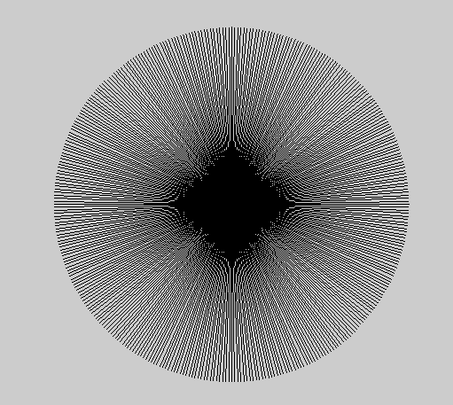
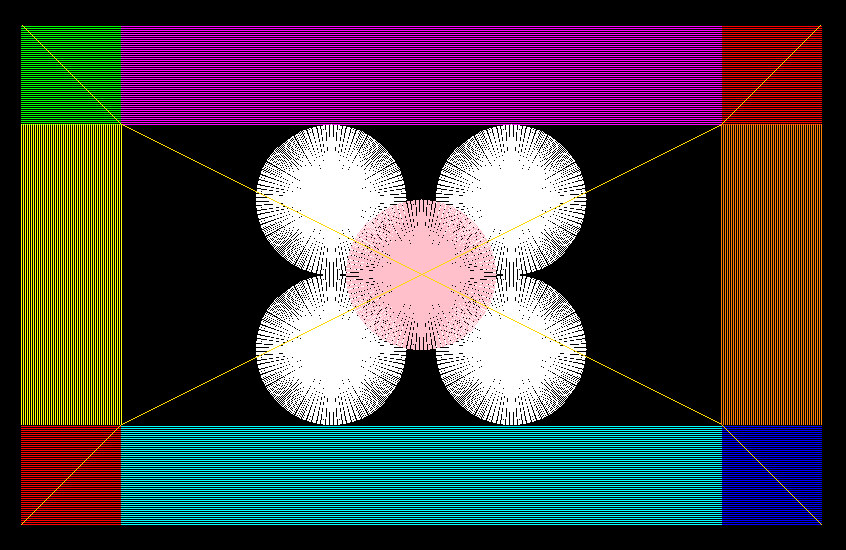

# Assignment1Report_part1 
In this assignment, we were asked to implement the **Bresenham algorithm** in order to draw lines on the raster screen.

We split our implementation into 3 main cases:

- Drawing vertical lines (fixed coordinate for x, changing coordinate for y).
- Drawing horizontal lines (fixed coordinate for y, changing coordinate for x).
- Drawing diagonal lines in all directions

And as you can see in the project's history, the 'drawing diagonal lines' was the hardest to implement - hence the evolvement of the original function into two different ones.

## Full Implementation
```cpp
void Renderer::DrawLine(const glm::ivec2& p1, const glm::ivec2& p2, const glm::vec3& color) {
	// Implement bresenham algorithm

	// if it's the same point, you draw the point and that's it
	if (p1 == p2) {
		PutPixel(p1.x, p1.y, color);
		return;
	}

	// calculating x difference
	int deltaP = p2.x - p1.x;
	// if deltaP is 0, it's a straight line up or down 
	if (deltaP == 0) {
		drawX(p1, p2, color);
		return;
	}

	// calculating y difference
	int deltaQ = p2.y - p1.y;
	// if deltaQ is 0, it's a straight line left or right 
	if (deltaQ == 0) {
		drawY(p1, p2, color);
		return;
	}

	/* since deltaQ / deltaP are absolute values, slopeA can be
	* 0 < a < 1
	* a > 1 -> in that case, x and y switch roles */
	float slopeA = ((float)abs(deltaQ)) / ((float)abs(deltaP));
	if (slopeA < 1) {
		slopeFloat(p1, p2, color, deltaQ, deltaP);
	}
	else {
		slopeInt(p1, p2, color, deltaQ, deltaP);
	}
}

void Renderer::drawX(const glm::ivec2& p1, const glm::ivec2& p2, const glm::vec3& color) {
	int start, finish, xValue = p1.x;
	// choose starting point as the lowest of the two
	if (p1.y > p2.y) {
		start = p2.y;
		finish = p1.y;
	}
	else {
		start = p1.y;
		finish = p2.y;
	}
	while (start <= finish) {
		PutPixel(xValue, start, color);
		start++;
	}
}

void Renderer::drawY(const glm::ivec2& p1, const glm::ivec2& p2, const glm::vec3& color) {
	int start, finish, yValue = p1.y;
	// choose starting point as the lowest of the two
	if (p1.x > p2.x) {
		start = p2.x;
		finish = p1.x;
	}
	else {
		start = p1.x;
		finish = p2.x;
	}
	while (start <= finish) {
		PutPixel(start, yValue, color);
		start++;
	}
}

void Renderer::slopeFloat(const glm::ivec2& p1, const glm::ivec2& p2, const glm::vec3& color, int DQ, int DP) {
	int mX0, mX1, mY0, mY1, mDx, mDy;
	int index, D, start;

	if (p1.x > p2.x) {
		mX0 = p2.x;
		mX1 = p1.x;
		mY0 = p2.y;
		mY1 = p1.y;
		mDx = -DP;
		mDy = -DQ;
		start = p2.y;
	}
	else {
		mX0 = p1.x;
		mX1 = p2.x;
		mY0 = p1.y;
		mY1 = p2.y;
		mDx = DP;
		mDy = DQ;
		start = p1.y;
	}

	if (mDy < 0) {
		index = -1;
		mDy *= (-1);
	}
	else {
		index = 1;
	}
	D = (2 * mDy) - mDx;

	for (int i = mX0; i < mX1; i++) {
		PutPixel(i, start, color);
		if (D > 0) {
			start += index;
			D += (2 * mDy) - (2 * mDx);
		}
		else {
			D += (2 * mDy);
		}
	}
}

void Renderer::slopeInt(const glm::ivec2& p1, const glm::ivec2& p2, const glm::vec3& color, int DQ, int DP) {
	int mX0, mX1, mY0, mY1, mDx, mDy;
	int index, D, start;

	if (p1.y > p2.y) {
		mX0 = p2.x;
		mX1 = p1.x;
		mY0 = p2.y;
		mY1 = p1.y;
		mDx = -DP;
		mDy = -DQ;
		start = p2.x;
	}
	else {
		mX0 = p1.x;
		mX1 = p2.x;
		mY0 = p1.y;
		mY1 = p2.y;
		mDx = DP;
		mDy = DQ;
		start = p1.x;
	}

	if (mDx < 0) {
		index = -1;
		mDx *= (-1);
	}
	else {
		index = 1;
	}
	D = (2 * mDx) - mDy;

	for (int i = mY0; i < mY1; i++) {
		PutPixel(start, i, color);
		if (D > 0) {
			start += index;
			D += (2 * mDx) - (2 * mDy);
		}
		else {
			D += (2 * mDx);
		}
	}
}
```

## Sanity Check
We tested the correctness of our implementation by drawing lines in the shape of a circle.
Code inside Render function:
```cpp
// draw circle
	int rad = 200;
	double pi = acos(-1), temp;
	int cost, sint;

	for (int i = 0; i < 360; i++) {
		temp = i * (pi / 180.0);
		cost = round(rad * cos(temp));
		sint = round(rad * sin(temp));
		DrawLine(glm::ivec2(half_width, half_height), glm::ivec2(half_width + cost, half_height + sint), glm::vec3(0, 0, 0));
	}
```

## Original Image
We draw a multi-colored frame and at the center - a flower of sort
Code inside Render function (declarations of variables rad, pi, temp, cost, sint - in the sanity check):
```cpp
// draw shape
	for (int i = 200, j = 100; j < 200; j += 2) {
		DrawLine(glm::ivec2(i, j), glm::ivec2(i + 100, j), glm::vec3(1, 0, 0));
		DrawLine(glm::ivec2(i, j + 400), glm::ivec2(i + 100, j + 400), glm::vec3(0, 1, 0));
		DrawLine(glm::ivec2(i + 700, j), glm::ivec2(i + 800, j), glm::vec3(0, 0, 1));
		DrawLine(glm::ivec2(i + 700, j + 400), glm::ivec2(i + 800, j + 400), glm::vec3(1, 0, 0));

		DrawLine(glm::ivec2(i + 100, j), glm::ivec2(i + 700, j), glm::vec3(0, 1, 1));
		DrawLine(glm::ivec2(i + 100, j + 400), glm::ivec2(i + 700, j + 400), glm::vec3(1, 0, 1));
	}

	for (int i = 200, j = 200; i < 302; i += 2) {
		DrawLine(glm::ivec2(i, j), glm::ivec2(i, j + 300), glm::vec3(1, 1, 0));
		DrawLine(glm::ivec2(i + 700, j), glm::ivec2(i + 700, j + 300), glm::vec3(1, 0.5, 0));
	}

	rad = 75;
	int a = 510, b = 275, c = 425, d = 690, e = 600, f = 350;

	for (int i = 0; i < 360; i++) {
		temp = i * (pi / 180.0);
		cost = round(rad * cos(temp));
		sint = round(rad * sin(temp));
		DrawLine(glm::ivec2(a, b), glm::ivec2(a + cost, b + sint), glm::vec3(1, 1, 1));
		DrawLine(glm::ivec2(a, c), glm::ivec2(a + cost, c + sint), glm::vec3(1, 1, 1));
		DrawLine(glm::ivec2(d, b), glm::ivec2(d + cost, b + sint), glm::vec3(1, 1, 1));
		DrawLine(glm::ivec2(d, c), glm::ivec2(d + cost, c + sint), glm::vec3(1, 1, 1));
	}

	for (int i = 0; i < 360; i++) {
		temp = i * (pi / 180.0);
		cost = round(rad * cos(temp));
		sint = round(rad * sin(temp));
		DrawLine(glm::ivec2(e, f), glm::ivec2(e + cost, f + sint), glm::vec3(1, 0.753, 0.796));
	}

	DrawLine(glm::ivec2(200, 100), glm::ivec2(300, 200), glm::vec3(1, 0.843, 0));
	DrawLine(glm::ivec2(300, 200), glm::ivec2(900, 500), glm::vec3(1, 0.843, 0));
	DrawLine(glm::ivec2(900, 500), glm::ivec2(1000, 600), glm::vec3(1, 0.843, 0));
	DrawLine(glm::ivec2(200, 600), glm::ivec2(300, 500), glm::vec3(1, 0.843, 0));
	DrawLine(glm::ivec2(300, 500), glm::ivec2(900, 200), glm::vec3(1, 0.843, 0));
	DrawLine(glm::ivec2(900, 200), glm::ivec2(1000, 100), glm::vec3(1, 0.843, 0));
```
