# Assignment1Report_part2
## Load Mesh:
In this assignment, we load a small mesh using the obj file describing the mesh.

We have performed a few changes in preparation for that:
- Enlarging the screen from 1280 x 720 to a full screen of 1920 x 1080
- Setting the background color scheme to all black – the model will be drawn in white to increase contrast
- We call the **Utility class – LoadMeshModel** method, and output the model's vertices, normals and faces to the console using cout. The model is now set to be the **active** one in the scene 

We used the Demo obj file in this case because it was the shortest.
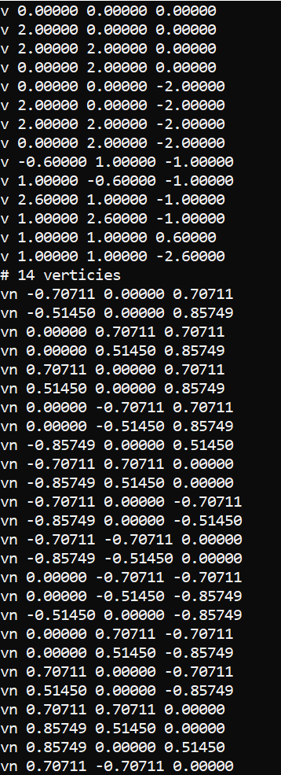
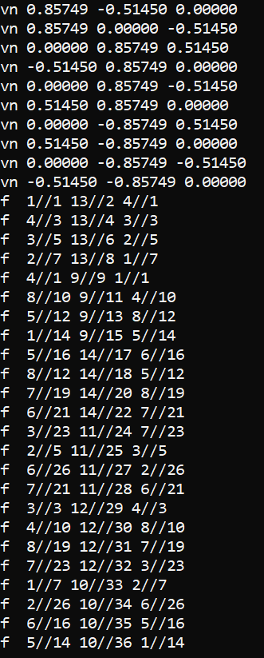
## Initial Transformation:
Most of the models we have here are either incredibly small or simply drawn outside the window thanks to it's coordinates. That is why we scale and translate each model when it's initially being loaded so it would fit the screen.
- Each time a model is construct, the constructor calls **InitialLoading** method which sets the parameters for the scaling and translations
- We want to load the model in the middle of the screen, so we use the new screen measurements to translate the model about 900 units in x and 500 units in y
- We also set scaling to be 100. In combination with the translation, we checked and saw this scaling size works best for our models
- The method construct the scaling and translation matrices according to those new measurements, and call **GetNewModel** to directly receive the full transformed model.
- We go through every vertex, convert it from 3D to 4D homogeneous vertex with the additional coordinate of 1, and multiply it with the transformation matrix. We than convert it back to 3D by ignoring the additional coordinate. 
## Drawing Mesh:
- In the **Renderer class – Render** method, we transfer the **active transformed** model from the scene object
- This is a triangle mesh model – we go through every face, find it's 3 vertices, ignore the z value, and draw the triangle in white using the **DrawLine** method.

If this is the empty screen, the model should be fully presentable by now
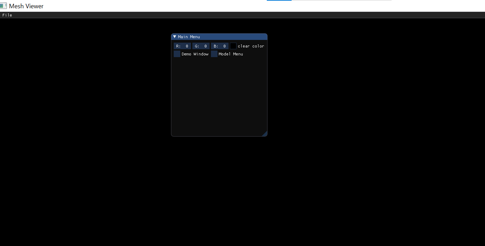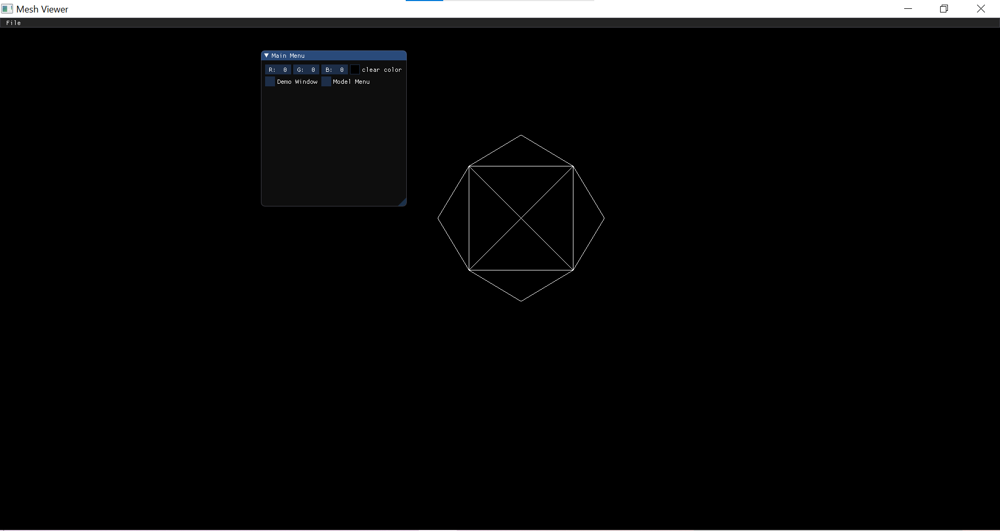
## GUI Items For Transformations:
There are two kinds of transformations we need to consider: 
- Model frame
- World frame 

In each of them, we have 7 options
- Translation of x, y, z
- Scaling
- Rotation of x, y, z

Because we submitted this assignment as a team of 2, there were two additional requirements that we needed to consider:
- Loading more than one mesh and switching between them
- Implementing both mouse and keyboard directed transformations
### And so we have built the model menu as followed:
- At the top of the menu – mouse transformations 
- You chose a frame (model or world) and thus appear sliders for each of the 7 options
- Each change happens independently, so the moment we move a slider we can see the visual changes on the screen
- Since rotation is not commutative, it is important to have a single order of multiplication. Here it's Translation first, than scaling, than rotation (assembled from rotationX * rotationY * rotationZ)
- Below that – a checkbox to activate keyboard transformation
- Since it's the same 7 keyboard characters for both frames, you also need to chose a frame here and than press continuously until you reach the result
- When you turn the checkbox off, the keyboard option is disabled, the instructions disappear, and you are left with only the mouse option 
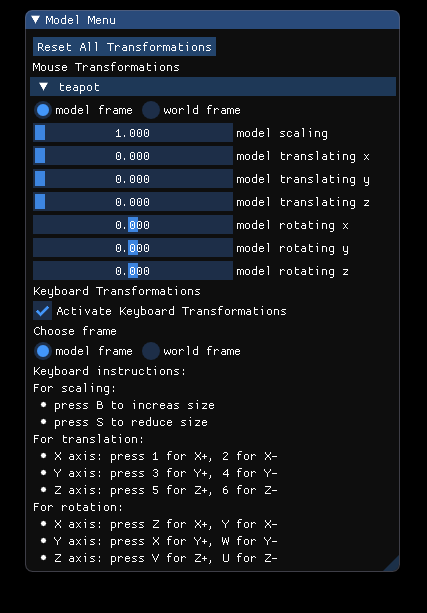
### How do you see the difference between world and model frames:
- When you do Translating in the Model frame and then Rotating in the World frame, the world still rotate around the original **origin**. Therefore we get a result that's much closer to the menu
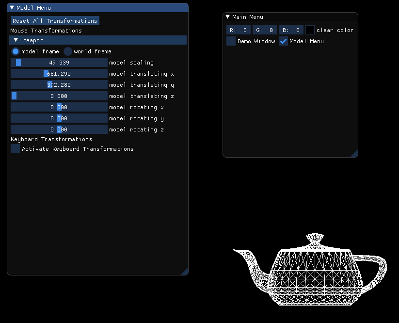
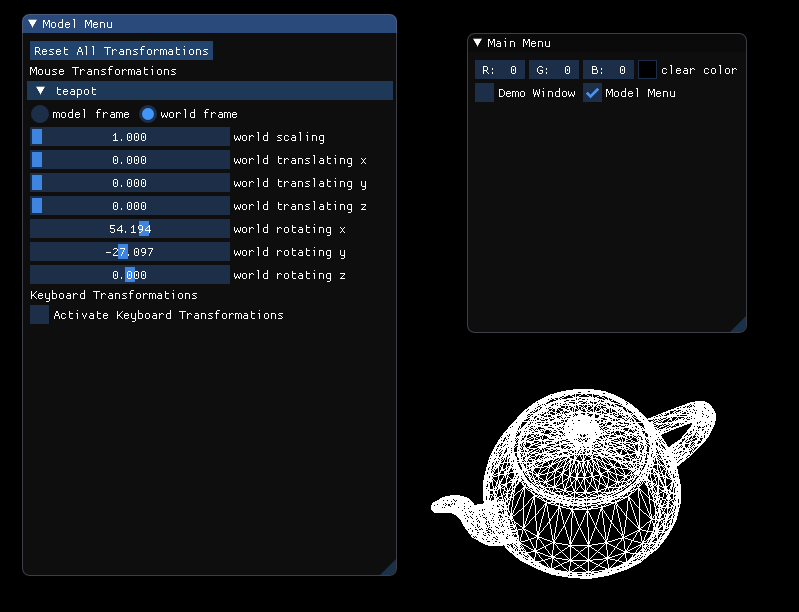
- When you do Translating in the World frame and then Rotating in the Model frame, we have now shifted the entire **origin**. Therefore we get a result that's a bit far away from the menu
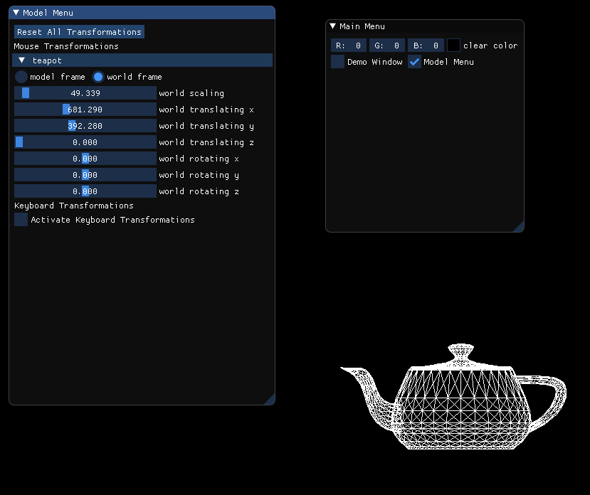
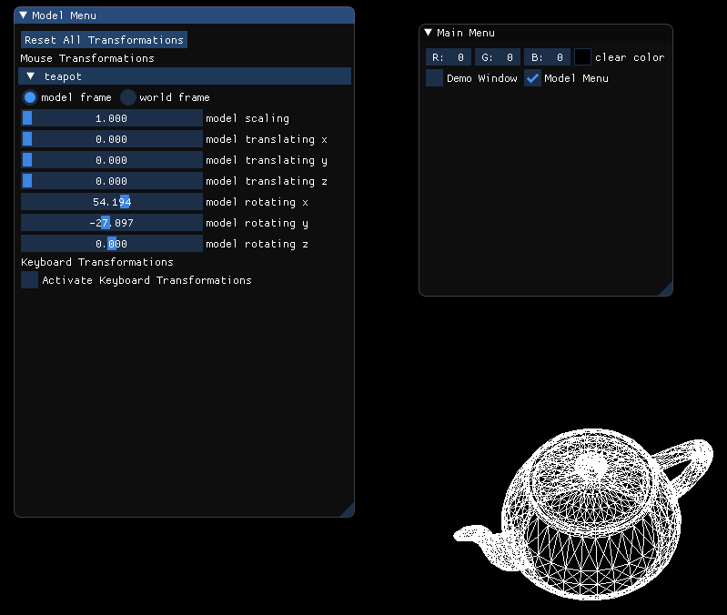
### How do you switch between models:
- The last model loaded automatically becomes the active model. 
- The moment we load more than one model, we get a button "activate" for the disabled ones, and we can switch between them
- Let's start with a transformed chain - teapot gets the activation button
- we than load a cow and transformed it too – the chain sliders are disabled, and it gets an activation button
- Than we press it and switch back to chain – the chain hasn't changed, hasn't been affected by the cow's transformations, and the cow now gets the activation button
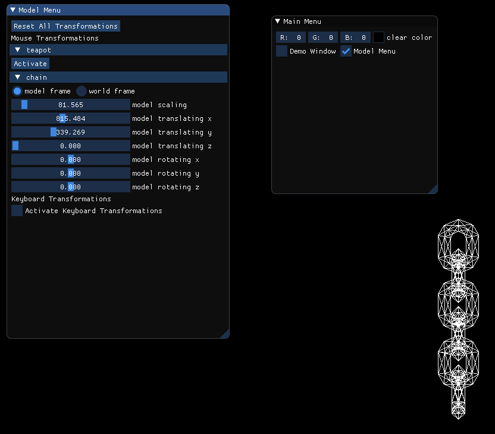 
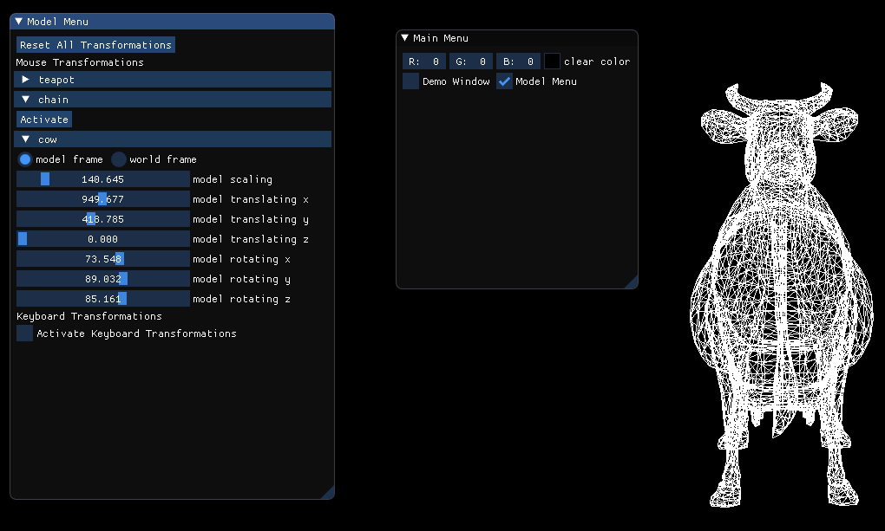 
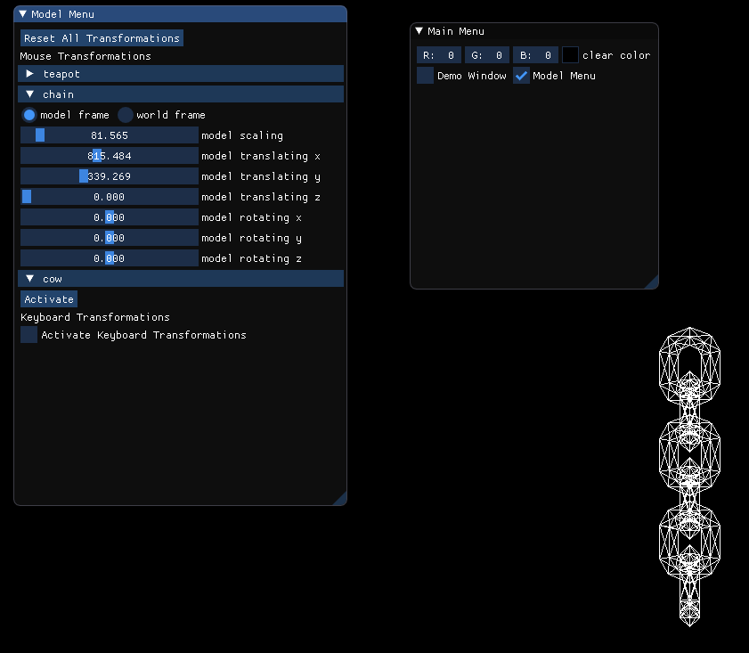 
### GIF
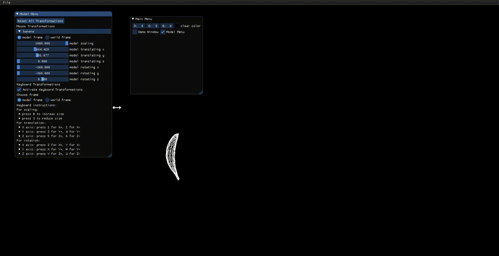