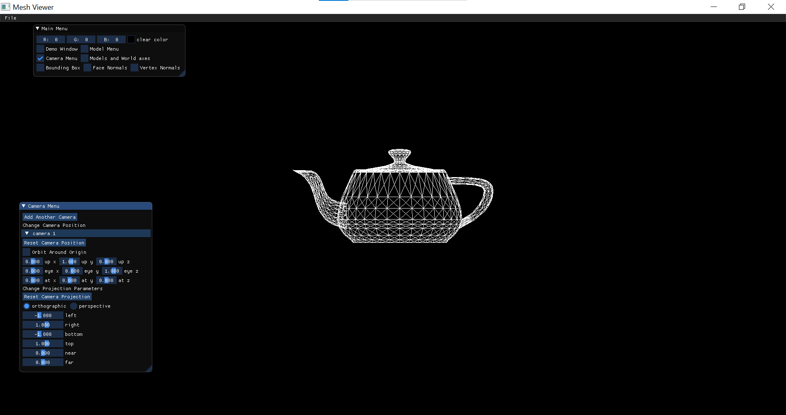

## General GUI:
Since we've added a lot of features in this assignment, and we were also asked to show screenshots of as much of our GUI as possible, we thought we would start with showing **what we have** and then explain each feature in turn.
- This is our main menu. It's now referring to the same model menu we had in our last assignment, but also to the camera menu, axes drawing, bounding box, and face and vertex normal.

- In our camera menu, the first camera is automatically loaded at the beginning of the program. All of our models are dependent on that. There are a few permanent features such as parameters for the **lookat** function, button for adding more cameras, and an option of orbiting the camera around origin. 
- We have 2 kinds of camera projections: on the left side we have **orthographic** projections and it's parameters, and on the right we have **perspective** projections and it's parameters. Each of those projections affect the way we see the models in the screen

## Loading Mesh:
- In our last assignment, we used a centering trick that would scale and translate the loaded object to the middle of the screen. 
- We have now removed that centering trick, and the object would be loaded to the screen with it's original coordinates.
- Therefore, each time the object is loaded we would, of course, place the object in the scene such that it is visible (inside the view volume)

- **Important Note: we are now able to present more than one object and use more than one camera at the same time on the screen. Some examples would show one object, others would show more!!!**
## Orthographic Projection:
- As you can see – we have implemented a camera with an orthographic projection.
- Our view volume is comprised of a matrix – it has 6 parameters: up, down, left, right, near, far.
- We have added a slider for each of those parameters – so that the user can change them and receive it's own view volume.
- Let's compare the results of 2 different view volumes:
- This is the original one – left and bottom are assigned as -1, right and up are assigned as 1, near and far are 0

- Now we replace left and bottom with right and up. Left and bottom are now 1, right and up are -1

- As you can see, the view volume now is very different. Each object has basically performed reflection – 180 degrees on x axis and 180 degrees on y axis
- Now we have reset those parameters and are now changing near and far. 
- Notice: the objects don't change! 

## LookAt Method:
- In order to position the camera, we must consider 3 parts:
- Our original camera position is (0, 0, 1) – where our **eye** is
- We look **at** the origin (negative z direction) – we look at (0, 0, 0)
- Our head is **up** - (0, 1, 0)
- We allow the user to reposition the camera using incremental changes.
- If we have 3 vectors assembled from 3 parameters each – we have 9 sliders that the user can alter
- Any time we change something, the view matrix of the camera is affected
- We would show results for 2 different camera positions:
- This is the original one

- All we had to do was change where we stand – our camera (eye) is now at (0, 0, -1) – we now still look at origin, only now it's the positive z direction. 
- Notice what happened – the dolphin just flipped. We now look at it from the other way, and so everything that used to be on our left side is now on the right side and the same goes for everything that used to be on the right

- The same goes for transformations: we loaded a second object and translated it in the "negative" x direction, and the object instead moves in the "positive" x direction 

## Window Size:
- We have now reset the parameters of the lookat method, and allow the user to change the view volume automatically based on the window's size.
- This is our original screen – full screen

- Now we change the screen and make it smaller – we have a half screen and you can see the word file open behind it. 

- The proportions of the drawn objects indeed remain the same (you can see that neither the camera nor the model menus changed). That is in fact our way of checking that it worked – as long as no menu or object changes as a reaction to the screen size, everything is working as it should
- In fact, we now return to full screen and the objects and menus are the same (in a bigger screen)

 ## Drawing Axes:
- For each model, it's axes are drawn as short lines (red for x, green for y, blue for z)
- As for the world, it's axes are drawn as really long lines that encompasses the entire screen (purple for x, cyan for y, yellow for z)
- An example for transforming in the model frame – the world remains static, only the model is transforming

- An example for transforming in the world frame – both the world and the model within it transform

- Now we would load a different mesh
- We rotated in the world frame and then translated in the model frame

- In comparison to translating in the world frame and then rotating in the model frame 

- The difference between them is seen quite clearly! In the beginning we rotate the whole world and then the model translate independently. But in the second one we translate the whole world and then the model rotate in **origin**
## Bounding Box:
- Each object has a bounding box that encompasses the object within it
- The limits of the bounding box are dependent upon the object – we take the minimum x, y, z coordinates of the object, as does the maximum x, y, z coordinates. From them we assimilate 8 points (4 in the "front" of the object and 4 in the "back") and by drawing lines between them we create a box

- Now we load a few other models as well – and you can see that each of them has it's own bounding box. If there are transformations (model / world frame) – the box adapts as well

## Normals:
- We display the face normals as green lines, drawn outward from the center of the face 

- We display the vertex normals as red lines, drawn outward from the model's vertices

- Notice that, as requested, they are scaled reasonably 
- As you can see here, the normal are transformed correctly with rotation and translation

- That is, in fact, our "sanity check". The direction of the vertices and faces change in rotation – therefore  their normal change as well 
## Perspective Projection:
- As you can see – we have implemented a camera with a perspective projection.
- Our view volume is comprised of a matrix – it has 4 parameters: field of view (fovy), aspect ratio according to (width / height), near, far.
- We have added a slider for each of those parameters – so that the user can change them and receive it's own view volume.
- Let's see the results in comparison to orthographic projection:
- If this is the orthographic projection:

- Then simply by moving to perspective and changing the aspect ratio we get a much bigger model (much more centered in the screen as well)

- Our "sanity check" here is that, in orthographic, there is no perspective. The teapot seemed flat. But in perspective you can see a much bigger difference between the body of the teapot and the handle, as well as the volume of each 3 parts 
## Zoom:
- In perspective, we have a zoom effect
- We change the size of the frustum (measured in radians – between 1 and 179) and either zoom in to the object or zoom out from it.
- Zoom in

- Zoom out 

## Multiple Models & Cameras:
- Earlier in the report we put screenshots containing multiple models – all at the same screen
- In this example, however, we added each model it's own camera
- Each camera is, of course, independent of it's sisters. It has it's own view volume and perspective (you can see in the menu that each camera is either activated with parameters or disabled at the moment)

## Orbit Around Origin:

