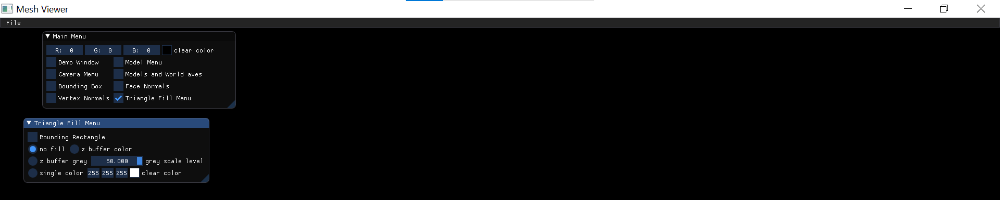
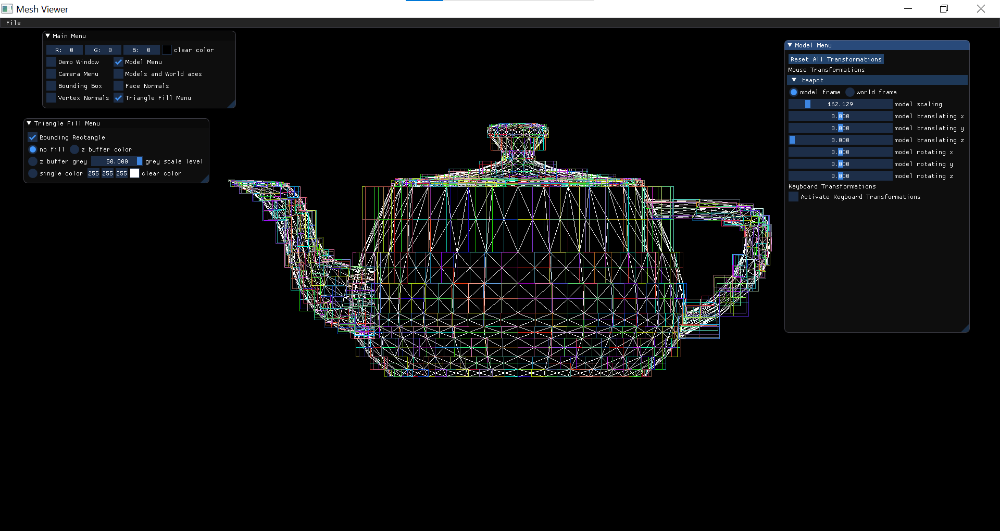
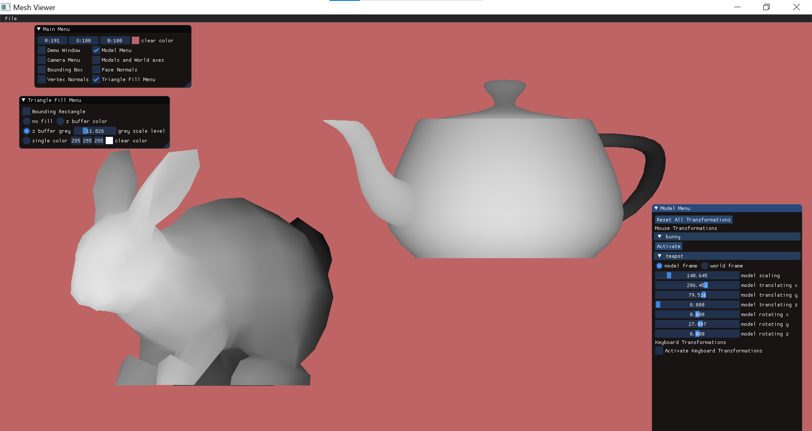
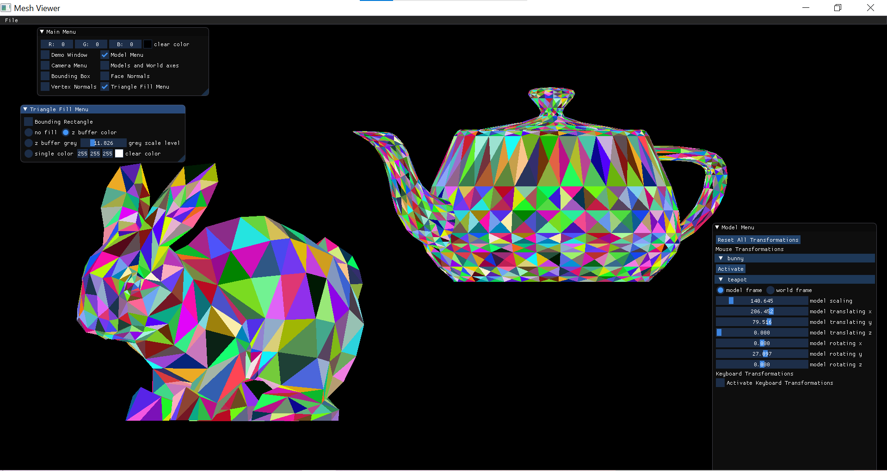
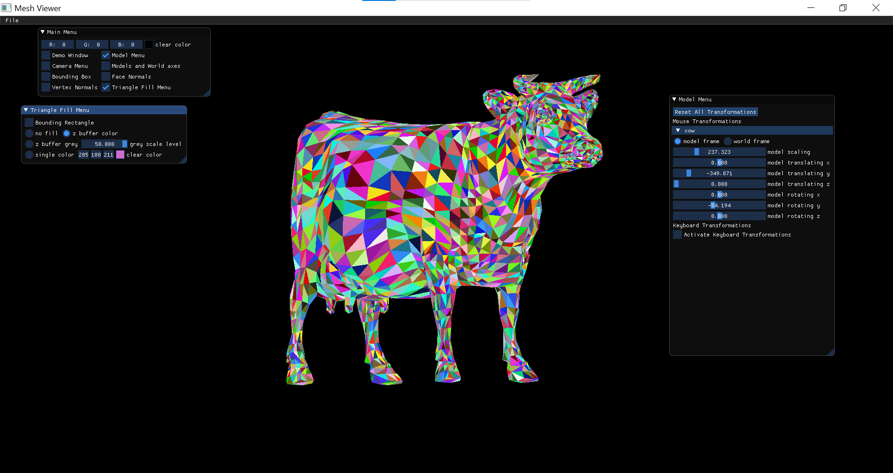

## Bounding Rectangles:
- We build a whole new menu dedicated to this assignment 

- The bounding rectangles feature is optional through a checkbox (can be turned on and off) 
- Once the checkbox is marked, each face (triangle) would receive a bounding box of it's own. The bounding rectangles would, of course, be subjected to the same transformations as the object itself
- It is important to mention that the color of the rectangle is related to the depth of the triangle – the colors we see (closer to us) are much brighter than those in the back

## Filling Triangles:
### Using Edge Walking, Z Buffer Algorithm:
- We created a color vector for the random colors and a Z buffer that would hold the z values of the pixels that were currently colored just now
- For every face (of every model) we sorted the 3 vertices for minimum and maximum values of x and y
- According to the sorting, we "walked" between 2 vertices twice (for example 1 & 2 and than 1 & 3) – and commanded the pixels in that range to be colored (either as a greyscale image or by random colors)
- Unlike the scanline approach, we didn't draw the triangles first and than filled them – the limits of the triangle (edges), as does the inner filling, were painted together (**Edge Walking**)
- In addition, we saved the z values of all 3 vertices – so that when we command the pixel to be colored, we use the z buffer algorithm in order to check whether or not that pixel should be painted in the first place
- If our current z values are larger than what we have in the buffer – the pixels wouldn't be colored. Because we are trying to paint a pixel that stands behind another pixel that is already colored – and our current one wouldn't be seen
- If our current z values are smaller than what we have in the buffer – the pixels would be painted. And so for every z value that we "accept" – we update the buffer with our current values.
- For our greyscale image: the z values that are the smallest (closest to us) receive the brightest colors, while those that are bigger (in the back) becomes darker and darker.
- For our color image: we still choose which pixels to color with the z buffer algorithm – only with random colors instead of greyscale

## One color:
- The last feature we added was the ability to color the entire object with one color – not by the z buffer algorithm, but by simply coloring the pixels. 
- If we compare it to the z buffer color, we can see that the overlapping of triangles in the regular way creates an inability to distinguish between contours, which is bad for us (you don't really see the face of the cow)

 
