# Initial Settings:
- We implemented the ability to add point light to the scene
- Like every other menu we have implemented in the past – we are able to add multiple lights, and declare one of them as active at any point in time
- We allow the user to change the position of the light – as it is essential to both our diffuse and specular light (to be demonstrated later)
- We allow for 3 light modes (ambient, diffuse, specular), and 3 shading modes (flat, gouraud, phong)
- We have added 6 color vectors – 3 for light and 3 for the material (object). their combinations creates the "light":
	- Ambient light color
	- Diffuse light color
	- Specular light color
	- Ambient model color
	- Diffuse model color
	- Specular model color
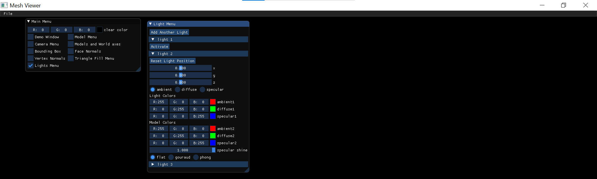
# Flat Shading:
In flat shading, the light calculations are very straight forward. We create a combination of light color and model color according to certain parameters:
## Ambient Light: 
- Take the light color and multiply it with the model color 
- That is because ambient light is not reliant on the position of he light or the camera – it's considered as light that comes from every direction and spread into every direction
- Since every color component gets multiplied separately (red x red, green x green, blue x blue) – if one of those components is black (zero), the results also becomes 0 (proves that black "swallow" other colors)
- And so it creates an image where there is a lot of overlapping of faces and colors – which makes it very hard to see inner contours of the shape. By choosing Red as the primary color here, we received this:
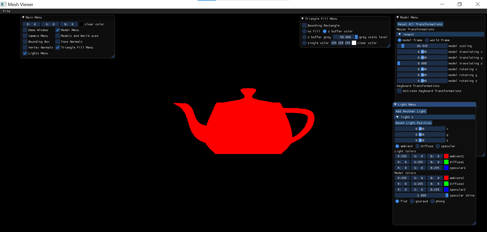
## Diffuse Light:
- Calculate the direction of light by subtracting the position of the vertex from the position of the light. Do the cross product between that and the vertex normal – and only than multiply with light color and model color
- We used a combination of red ambient color and green diffuse color – and so the multiplication with the cross product gives us different results at different locations on the object (notice that the red blend into yellow)
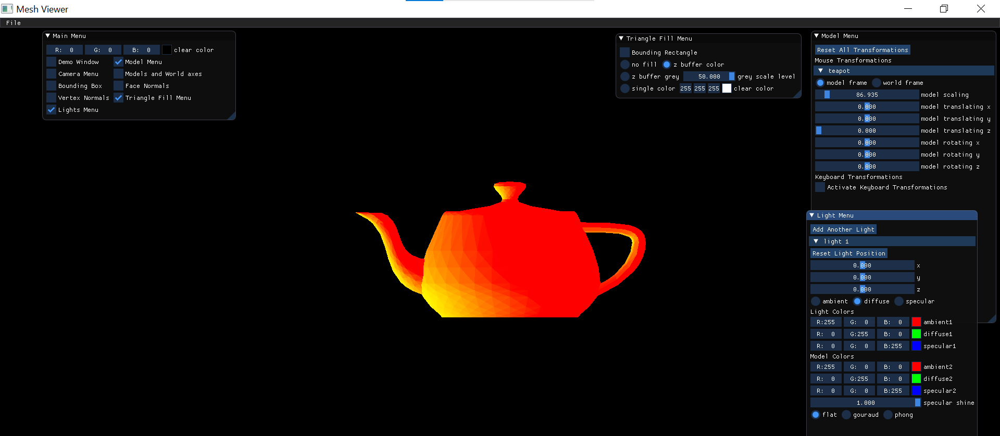
- Also notice: the position of the light now plays a part in the color scheme. We have chosen a different position – and the difference is very noticeable
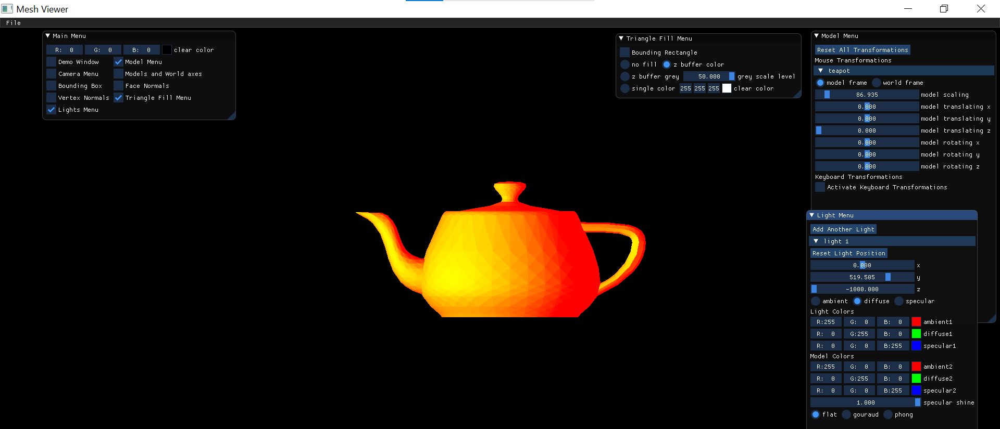
## Specular Light:
- Specular light is shown when the light reflects in the opposite direction from it's source
- We now calculate the reflected light vector by reflecting (minus) light direction vector and the vertex's normal 
- In addition, we also have the camera's position to consider. We get the camera's direction vector by the same process of subtracting the position of the vertex from it.
- Cross product between those two…
- And now the last parameter to be considered is alpha (shine). We power the cross product by alpha and only than do we multiply with light color and model color
- We have red for ambient, green for diffuse and blue for specular. We can of course see all the points where it "shines"
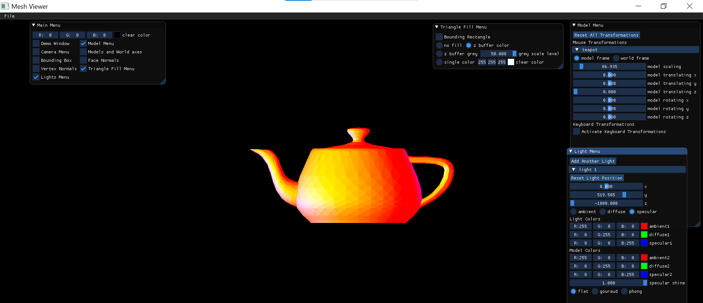
- We would also like to show an example of how the alpha parameter greatly affects the model. The first picture is where alpha = 1. The second picture is where alpha = 0. It shines – but in a completely different way
 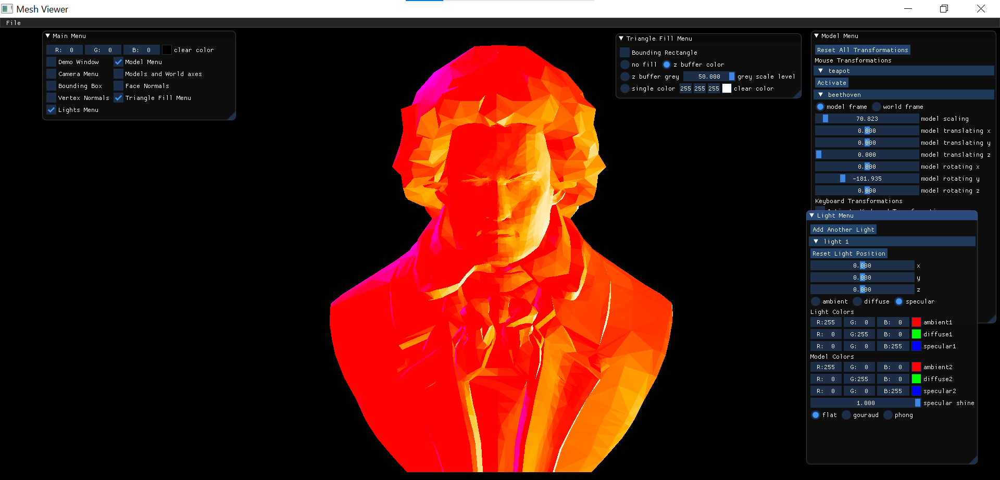
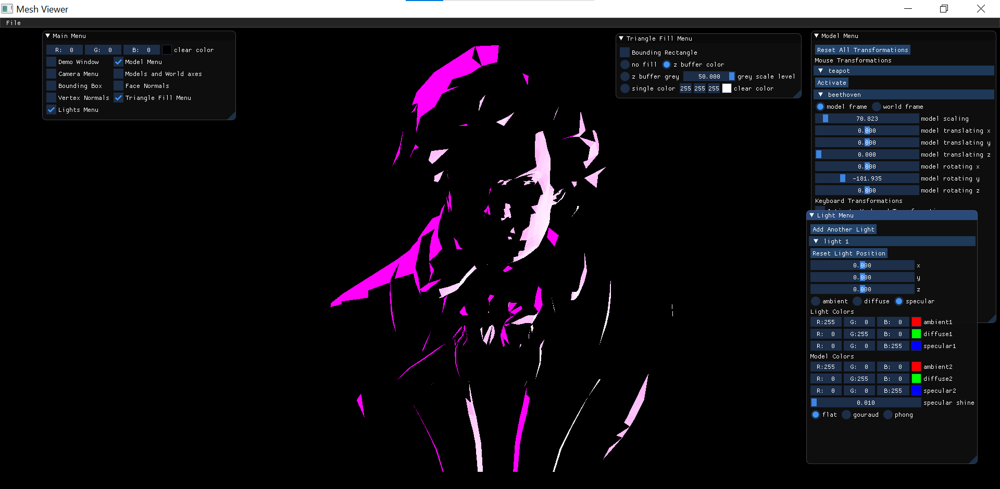
# Gouraud Shading:
In Gouraud shading, we use the normal of each vertex in order to find the color of each vertex. We then use that by saying that every point in the face is determined by linear interpolation over those colors
- Ambient color: stays the same
- Diffuse color: we would put 2 pictures side by side. The left one is diffuse in flat (we have seen it before) and the right one is diffuse in Gouraud. Notice the smoothness of the Gouraud shading in comparison to the flat shading
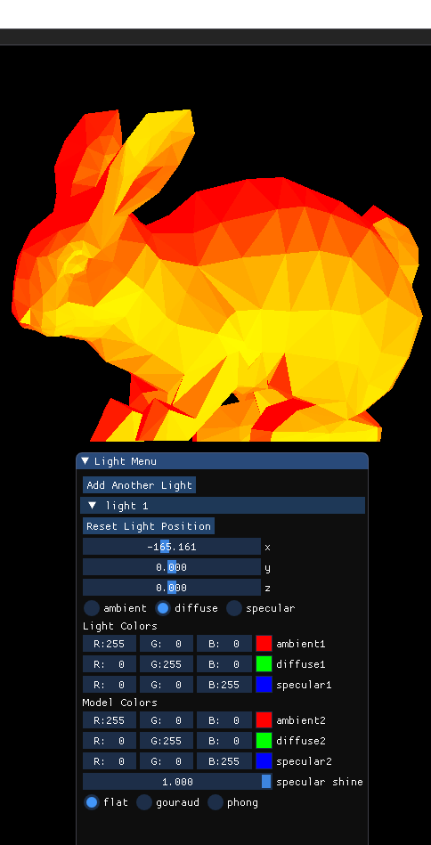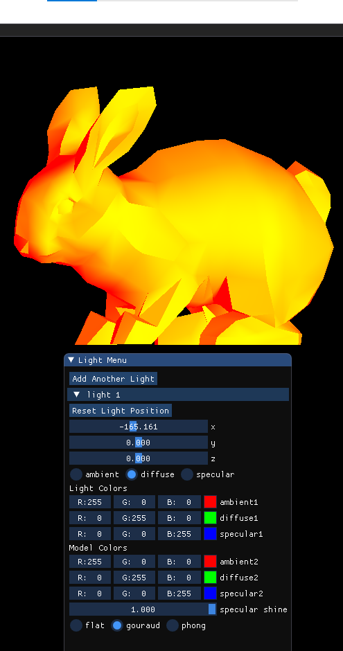
- Specular color: again we would put 2 pictures side by side. The left one is specular in flat (we have seen it before) and the right one is specular in Gouraud. Notice not only the smoothness of the Gouraud shading in comparison to the flat shading – but also the shine effect. It looks so much better in the Gouraud shading

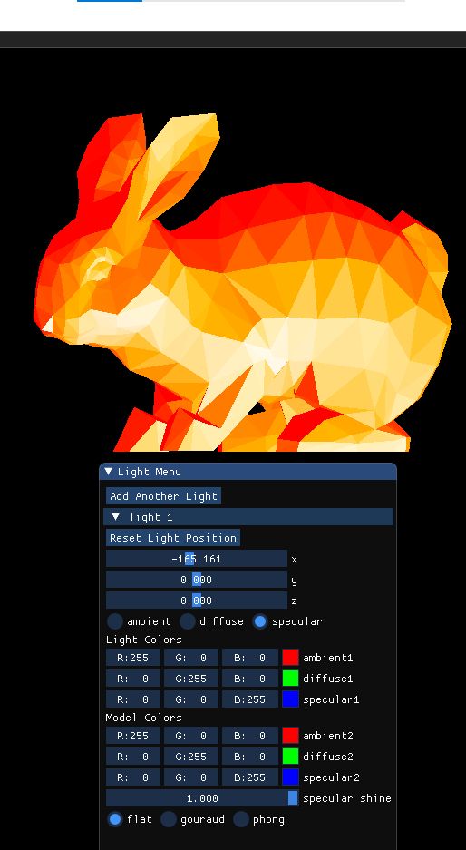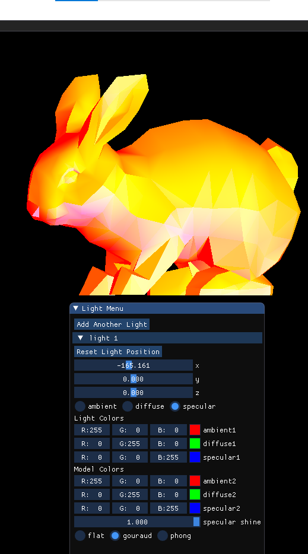
# Phong Shading:
In Phong shading, we calculate the normal for each point in the face by interpolation of vertex normals. Only than do we calculate the color according to this new normal
- Once again the ambient stays the same, and even the diffuse doesn't show that much of a difference.
- The specular, on the other hand, can now be compared through 3 modes of shading – and the difference is very noticeable 
	- First picture: Flat still shows the outlines of faces
	- Second Picture: Gouraud removes those outlines, but the spreading of light is inequal
	- Third picture: We can see exactly where the light hits the sphere, and the shine effect is definitely working

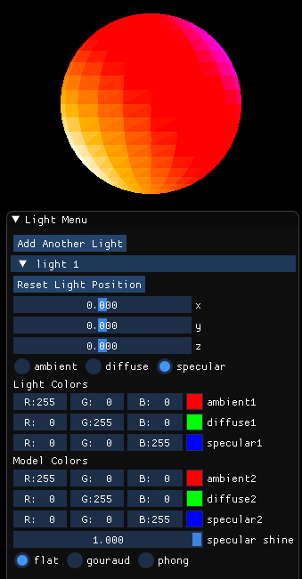
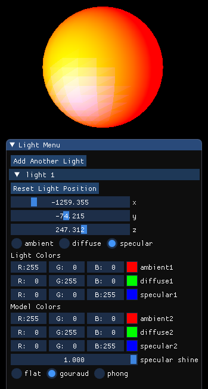
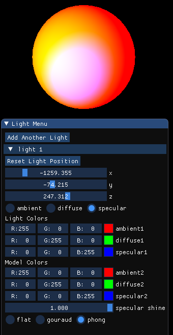
